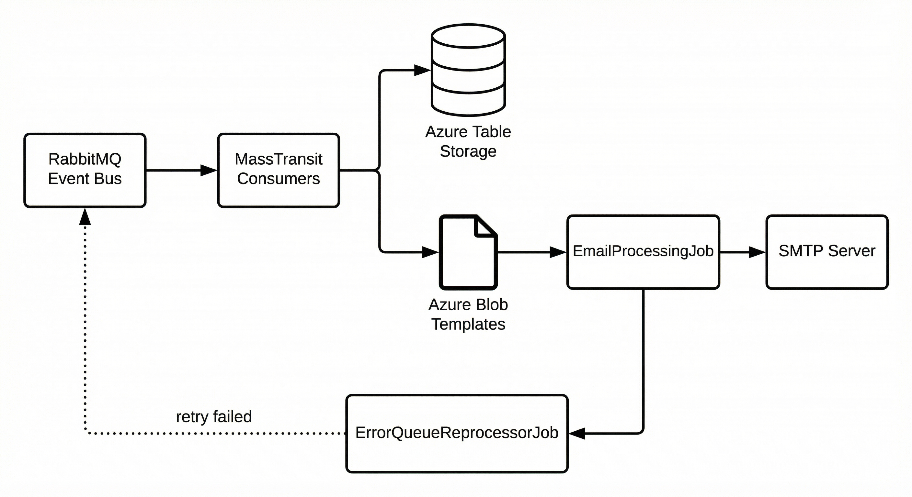

# Blogsphere.Notification.Service

A .NET 8 background service that processes notification events from RabbitMQ and sends emails. Part of the Blogsphere ecosystem, it consumes event messages, persists notification records to Azure Table Storage, renders HTML email templates from Azure Blob Storage, and delivers emails via SMTP.

## Overview

The service acts as a notification hub that:

- **Consumes events** from RabbitMQ via MassTransit (AuthCode, User Invitation, Password Reset, Management User flows)
- **Persists notification history** to Azure Table Storage for idempotency and auditing
- **Renders emails** using HTML templates stored in Azure Blob Storage
- **Sends emails** via SMTP (e.g., Mailtrap for development)
- **Reprocesses failed messages** from RabbitMQ error queues with configurable retry limits

## Supported Notification Types

| Event | Description |
|-------|-------------|
| **UserInvitation** | Welcome/invitation email when a user is invited |
| **AuthCodeSent** | 2FA / authentication code email |
| **PasswordResetInstructionSent** | Password reset instructions email |
| **PasswordResetOneTimeCodeSent** | One-time code (OTP) for password reset |
| **ManagementUserWelcomeEmailSent** | Welcome email for management portal users |
| **ManagementUserPasswordEmailSent** | Password email for management portal users |

## Architecture



## Tech Stack

- **.NET 8** - Console/worker app
- **MassTransit.RabbitMQ** - Event consumption
- **Azure.Data.Tables** - Notification history persistence
- **Azure.Storage.Blobs** - HTML email template storage
- **MailKit** - SMTP email delivery
- **Serilog** - Structured logging
- **OpenTelemetry** - Zipkin/Jaeger tracing

## Prerequisites

- [.NET 8 SDK](https://dotnet.microsoft.com/download/dotnet/8.0)
- [RabbitMQ](https://www.rabbitmq.com/)
- [Azurite](https://docs.microsoft.com/en-us/azure/storage/common/storage-use-azurite) (for local Azure Storage emulation)
- SMTP server (e.g., [Mailtrap](https://mailtrap.io/) for development)

## Configuration

Key settings in `appsettings.json`:

| Section | Key | Description |
|---------|-----|-------------|
| **EventBus** | Host, Username, Password, VirtualHost | RabbitMQ connection |
| **EmailTemplates** | *per event* | Blob template name per notification type |
| **EmailSettings** | Server, Port, UserName, Password | SMTP server |
| **ConnectionStrings** | AzureTableStorage, BlobStorage | Azure Storage endpoints |
| **AppConfigurations** | NotificationProcessInterval | Seconds between email processing runs |
| **ErrorQueueReprocessor** | Enabled, PollIntervalSeconds, MaxAttempts, ErrorQueues | Error queue reprocessing |

## Running Locally

1. **Start dependencies** (RabbitMQ, Azurite) - e.g. via `docker-compose` in the parent Blogsphere repo or your local setup.

2. **Configure** `appsettings.json` or `appsettings.Development.json`:
   - EventBus: RabbitMQ host, credentials
   - EmailSettings: SMTP server (e.g., Mailtrap)
   - ConnectionStrings: Azure Table and Blob endpoints (use Azurite for local dev)

3. **Upload HTML templates** to Azure Blob Storage (or Azurite) in the `templates` container. Template names must match `EmailTemplates` config (e.g., `UserInvitationSent.html`, `AuthCodeSent.html`).

4. **Run the service**:
   ```bash
   cd src/Blogsphere.Notification.Service
   dotnet run
   ```

## Running with Docker

From the `src` directory:

```bash
# Create the external network (if not exists)
docker network create blogsphere_dev_net

# Start Azurite + Notification Service
docker compose -f docker-compose.yml -f docker-compose.override.yml up -d
```

The service depends on:
- **blogspherenfstrg** (Azurite) for Azure Table/Blob emulation
- **RabbitMQ** (from the parent Blogsphere setup)
- Env vars: `RABBITMQ_PASSWORD`, `EMAIL_USERNAME`, `EMAIL_PASSWORD`, `CONNECTION_STRING_AZURE_TABLE_STORAGE`, `CONNECTION_STRING_BLOB_STORAGE`

## Project Structure

```
src/Blogsphere.Notification.Service/
|-- BackgroundJobs/
|   |-- EventBusStarterJob.cs       # Starts MassTransit
|   |-- EmailProcessingJob.cs       # Polls Table Storage, sends emails
|   +-- ErrorQueueReprocessorJob.cs # Reprocesses RabbitMQ error queues
|-- Configurations/                # Options classes for appsettings
|-- Data/Storage/                  # Table and Blob repositories
|-- EventBus/
|   |-- Consumers/                 # MassTransit consumers per event type
|   +-- Contracts/                 # Event message definitions
|-- Models/                        # Constants, enums, DTOs
|-- Services/                      # EmailService
+-- Program.cs
```

## Error Queue Reprocessing

Failed messages land in RabbitMQ error queues (e.g., `auth-code-sent_error`). The `ErrorQueueReprocessorJob` periodically moves messages back to the original exchange for retry, up to `MaxAttempts`. Configure which queues to reprocess in `ErrorQueueReprocessor:ErrorQueues`.

## License

See [LICENSE](LICENSE) for details.
